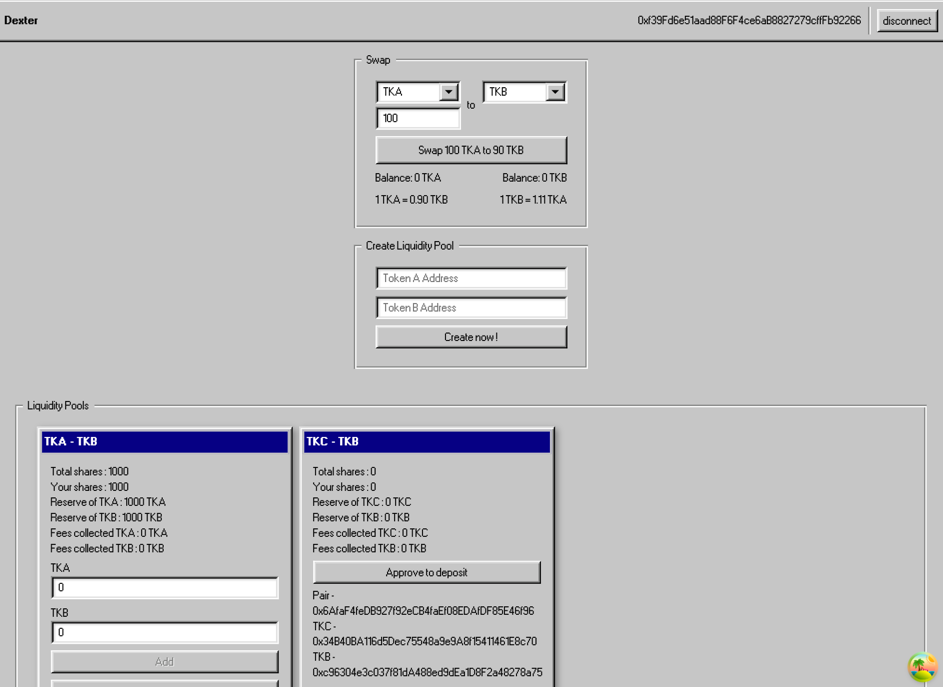

# Dexter - Solidity AMM Smart Contract

This project is an Automated Market Maker (AMM) on the Ethereum blockchain, inspired by the Uniswap V2 model. It allows users to swap ERC20 tokens and liquidity providers to earn revenue through transaction fees.



## Features

- **Liquidity Providers**: Add and remove liquidity in a pool in exchange for a share of transaction fees.
- **Token Swaps**: Swap between two ERC20 tokens with a fee deduction.
- **Fallback to Uniswap V2**: If no pool exists for a token pair, the swap is forwarded to Uniswap V2 with an additional fee.
- **User Interface**: Integration with [dexter-ui](https://github.com/theocerdan/dexter-ui) to interact with the DEX.

## Prerequisites

- Node.js and npm
- Hardhat
- An Ethereum wallet (e.g., MetaMask)

## Installation

Clone the project and install dependencies:

```bash
npm install
```

## Start Local Blockchain

The project uses a fork of the Ethereum mainnet. To start:

```bash
npx hardhat node
```

## Hardhat Commands

Several tasks are defined to test and interact with the smart contract.

### 1. Display the current block number
```bash
npx hardhat block-number
```

### 2. Check an account's balance
```bash
npx hardhat balance --account <address>
```

### 3. Check an account's ERC20 balance
```bash
npx hardhat balanceERC20 --account <address> --token <token-address>
```

### 4. Deploy the router and test tokens
```bash
npx hardhat router
```

### 5. Mint new tokens to an account
```bash
npx hardhat mint --target <token-address>
```

### 6. Transfer funds from one account to another
```bash
npx hardhat move-fund
```

### 7. Revoke allowance for a token pair
```bash
npx hardhat remove-allowance --target <pair-address>
```

## Interaction with the UI

The user interface allows you to:
- Connect your wallet
- View your connected address
- Select a token pair
- Simulate and execute a swap
- Track transaction progress
- Add and remove liquidity
