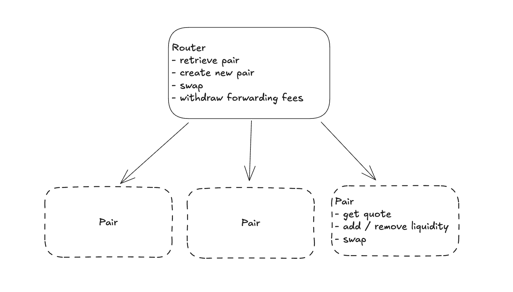

# Dexter - Solidity AMM Smart Contract

A lightweight, efficient Automated Market Maker (AMM) built on Ethereum, inspired by Uniswap V2's architecture.

## Features

- **Capital-Efficient Liquidity Provision**: Add and remove liquidity to earn transaction fees, with incentive mechanisms for maintaining optimal pool ratios
- **Seamless Token Swaps**: Execute ERC20 token exchanges and collect fees
- **Fallback Integration**: Automatic forwarding to Uniswap V2 when no native pool exists, with additional fees
- **Modern UI Integration**: Fully compatible with the [dexter-ui](https://github.com/theocerdan/dexter-ui) front-end for intuitive DEX interaction

## Installation

```bash
# Compile contracts
npx hardhat compile

# Run test suite
npx hardhat test
```

## Architecture

Dexter follows a Router/Pair architecture where the Router contract handles routing and forwading fee collection while Pair contracts manage individual liquidity pools.


## Smart Contract Interfaces

### Router
```solidity
function createPair(address tokenA, address tokenB) external;
function swap(uint256 amountIn, address tokenIn, address tokenOut) external payable;
function withdrawFees() external;
// Additional functions available in ./contracts/interfaces
```

### Pair
```solidity
function addLiquidity(uint256 amountA, uint256 amountB) external;
function removeLiquidity(uint256 liquidity) external;
function swap(address tokenIn, uint256 amountIn, address to) external;
function getQuote(address tokenIn, uint256 amountIn) external view returns (uint256);
// Additional functions available in ./contracts/interfaces
```

## Security

Dexter implements robust security measures including reentrancy protection, integer overflow/underflow prevention, and proper access controls.